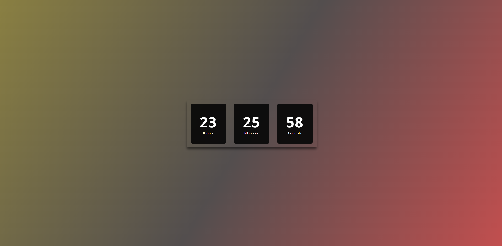

# Relógio Digital ⏳

> ## Descrição 📚
Esse projeto consiste em um app de um relógio digital sempre ajustado para o horário atual utilizando a classe Date do JavaScript. Agradecimentos à Larissa Kich, que disponibilizou em seu canal no youtube o tutorial para desenvolvimento desse projeto.

 
 

> ## Tecnologias 👨🏾‍💻
Foram utilizadas as seguintes tecnologias neste projeto:
+ Front-End :
  -  HTML5
  -  CSS3
  -  JavaScript

 
 

> ## Printscreen do Projeto 📸

 
 

> ## Autor 📝
+ [Ruan Cardoso](https://www.linkedin.com/in/ruancardosolinkdin/)
